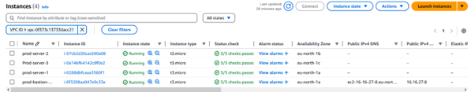
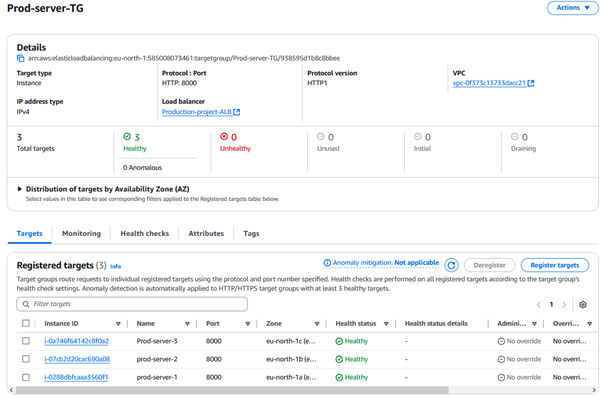
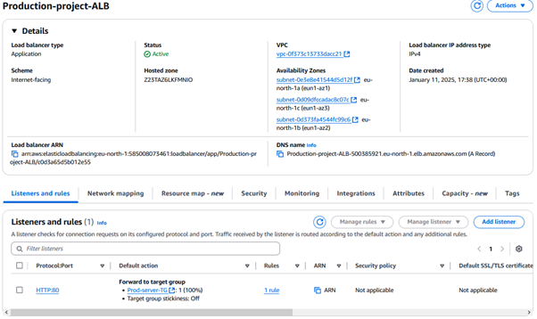
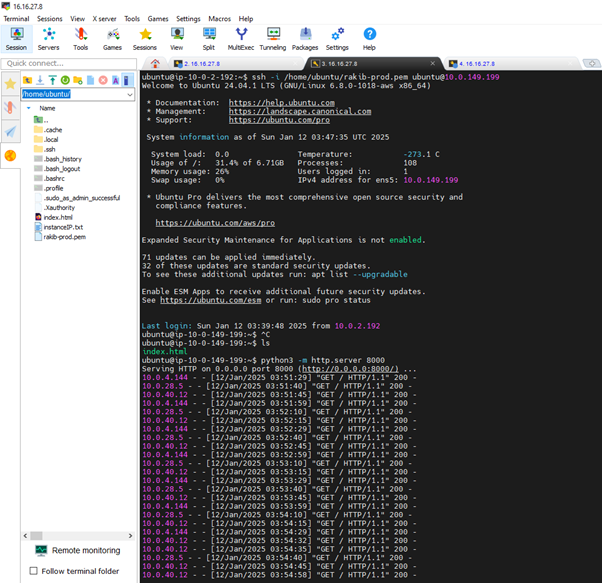
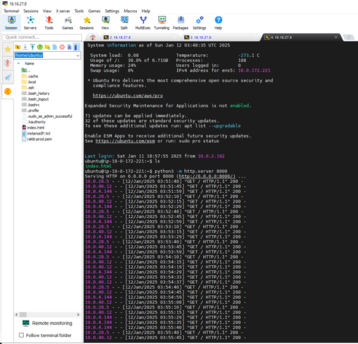
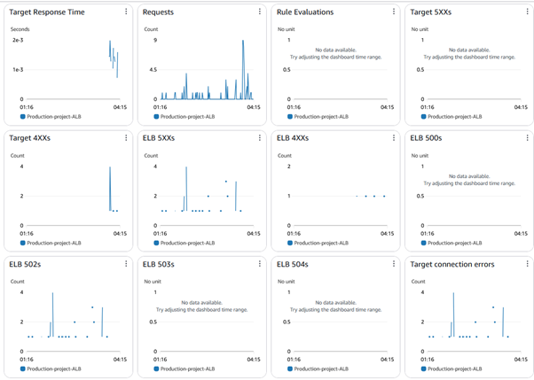

# Designed-and-Deployed-a-Web-Architecture-on-AWS
Designed and Deployed a Scalable, Secure, and Highly Available Web Architecture on AWS:

# Scalable AWS Web Architecture

A production-grade AWS architecture implementing a highly available, secure, and scalable web hosting solution across multiple Availability Zones.


## 🏗️ Architecture Overview

This project implements a robust web hosting solution using various AWS services, designed for high availability, security, and scalability.

### Key Components

#### 1. VPC and Network Design
- Custom VPC spanning 3 Availability Zones
- **Public Subnets**: Host internet-facing resources (ALB, Bastion)
- **Private Subnets**: Secure backend servers
- **NAT Gateway**: Enables outbound internet access for private resources

#### 2. Auto Scaling Configuration
- Auto Scaling Group managing instances across 3 AZs
- Automatic health checks and instance replacement
- Dynamic scaling based on traffic patterns

#### 3. Security Implementation
- **Bastion Host**: Secure SSH access to private instances
- **Security Groups**: Fine-grained access control
  - Port 22 (SSH)
  - Port 80 (HTTP)
  - Port 8000 (Python servers)
- **NACLs**: Subnet-level traffic control

#### 4. Load Balancing
- Application Load Balancer in public subnets
- Health checks ensure traffic routes to healthy instances
- Even traffic distribution across backend servers

## 📸 Implementation Screenshots

### VPC and Subnet Configuration
.

### Auto Scaling Group
.

### Load Balancer Setup
.

### Run python web server on 3-AZ on 3 private subnet




### Log and Monitoring

## 🚀 Deployment Guide

### Prerequisites
- AWS Account with appropriate permissions
- AWS CLI configured
- Python 3.x installed

### Step-by-Step Deployment

1. **VPC Setup**
```bash
aws cloudformation create-stack \
  --stack-name vpc-stack \
  --template-body file://templates/vpc.yaml
```

2. **Security Groups**
```bash
aws cloudformation create-stack \
  --stack-name security-stack \
  --template-body file://templates/security.yaml
```

3. **Load Balancer and Auto Scaling**
```bash
aws cloudformation create-stack \
  --stack-name app-stack \
  --template-body file://templates/application.yaml
```

## 📁 Project Structure

\`\`\`
.
├── templates/
│   ├── vpc.yaml         # VPC and networking infrastructure
│   ├── security.yaml    # Security groups and NACLs
│   └── application.yaml # ALB and ASG configuration
├── scripts/
│   ├── deploy.sh        # Deployment automation
│   └── cleanup.sh       # Resource cleanup
└── src/
    └── app.py          # Python HTTP server implementation
\`\`\`

## 🔒 Security Considerations

- All instances in private subnets
- Bastion host for secure access
- Security groups limit access to required ports
- NACLs provide additional subnet-level security
- HTTPS termination at load balancer

## 🔍 Monitoring and Maintenance

- CloudWatch metrics for performance monitoring
- Auto Scaling based on CPU utilization
- Health checks ensure system reliability
- Automated instance replacement on failure

## 📈 Performance Optimization

- Multi-AZ deployment for high availability
- Load balancer distribution algorithms
- Auto Scaling for handling traffic spikes
- Caching strategies implementation

## 🤝 Contributing

1. Fork the repository
2. Create a feature branch
3. Commit your changes
4. Push to the branch
5. Create a Pull Request

## 📝 License

This project is licensed under the MIT License - see the [LICENSE](LICENSE) file for details.
